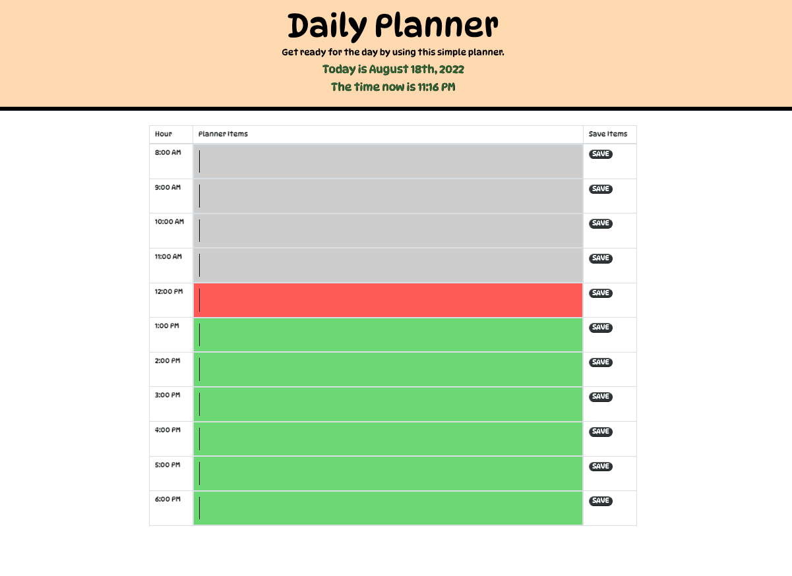

# <Daily-Planner>

## Daily Planner

## Table of Contents

- [Description](#description)
- [Installation](#installation)
- [User Story](#user-story)
- [Acceptance Criteria](#acceptance-criteria)
- [Mock Up](#mock-up)
- [Submission](#submission)
- [Credits](#credits)
- [License](#license)

## Description

<ul>
<li>
The motivation behind this project was to utilize a javascript library such as MomentJS, although deprecated, still provides a very useful layout of time/ date items.
</li>
<li>
Through MomentJS, the goal was to create a daily planner that uses the current time, and is able to save them to client-side/ local storage - all while displaying them later (assuming the user is using the same browser) without having to keep the page running. 
</li>
<li>
This project is a very nice outline of a simple tool that can be used to accomplish something professionals use in their every day lives.
</li>
</ul>

## Installation

<ol>
<li>
In order to begin this project, we must first have a suitable code viewer, such as VSCode. From there, we will need a base html file, and link our javascript, jquery, bootstrap, and css libraries to it.
</li>
<li>
Next we open a browser that supports dev tools like Google Chrome or Mozilla Firefox.
</li>
<li>
After we have our broswer and codeviewer open, we can begin to run our code and functions to ensure that we are getting the desired results.
</li>
<li>
After we finish our code, we eliminate any reduncies in the code to make it more viewable by other developers - and run our last few spot checks in various browsers to ensure the fully-deployed page is behaving correctly.
</li>
</ol>

## USER STORY

AS AN employee with a busy schedule

I WANT to add important events to a daily planner

SO THAT I can manage my time effectively

## ACCEPTANCE CRITERIA

GIVEN I am using a daily planner to create a schedule

WHEN I open the planner

THEN the current day is displayed at the top of the calendar

WHEN I scroll down

THEN I am presented with time blocks for standard business hours

WHEN I view the time blocks for that day

THEN each time block is color-coded to indicate whether it is in the past, present, or future

WHEN I click into a time block

THEN I can enter an event

WHEN I click the save button for that time block

THEN the text for that event is saved in local storage

WHEN I refresh the page

THEN the saved events persist

## MOCK UP

## SUBMISSION

The fully deployed webpage for this project can be found by using the GitHub Pages link below:

https://shahidhashmi1.github.io/daily-planner/

The supporting codebase and supporting files can be found by using the GitHub repository link below:

https://github.com/ShahidHashmi1/daily-planner

## Credits

The collaborators on this project included cohort member, Achilles, cohort member, Corey, instructor Eric Weiss, and TA Michael Kotte.

This project required a lot of reference to recent projects and coursework. The outside references included this site on [Template Literals][1], the [MDN][2] on getting items from local storage, and of course the libraries/ frameworks used for the project: [Bootstrap][3], [JQuery][4], and [Moment Js][5].

[1]: https://developer.mozilla.org/en-US/docs/Web/JavaScript/Reference/Template_literals "Template Literals"
[2]: https://developer.mozilla.org/en-US/docs/Web/API/Storage/getItem "MDN"
[3]: https://getbootstrap.com/docs/4.5/getting-started/introduction/ "Bootstrap"
[4]: https://jqueryui.com/ "JQuery"
[5]: https://momentjs.com/docs/#/displaying/ "Moment Js"

## License

MIT License

Copyright (c) 2022 ShahidHashmi1

Permission is hereby granted, free of charge, to any person obtaining a copy
of this software and associated documentation files (the "Software"), to deal
in the Software without restriction, including without limitation the rights
to use, copy, modify, merge, publish, distribute, sublicense, and/or sell
copies of the Software, and to permit persons to whom the Software is
furnished to do so, subject to the following conditions:

The above copyright notice and this permission notice shall be included in all
copies or substantial portions of the Software.

THE SOFTWARE IS PROVIDED "AS IS", WITHOUT WARRANTY OF ANY KIND, EXPRESS OR
IMPLIED, INCLUDING BUT NOT LIMITED TO THE WARRANTIES OF MERCHANTABILITY,
FITNESS FOR A PARTICULAR PURPOSE AND NONINFRINGEMENT. IN NO EVENT SHALL THE
AUTHORS OR COPYRIGHT HOLDERS BE LIABLE FOR ANY CLAIM, DAMAGES OR OTHER
LIABILITY, WHETHER IN AN ACTION OF CONTRACT, TORT OR OTHERWISE, ARISING FROM,
OUT OF OR IN CONNECTION WITH THE SOFTWARE OR THE USE OR OTHER DEALINGS IN THE
SOFTWARE.
